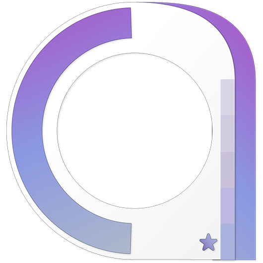

<div align="center">
    
    <p>Fabulous Desktop (Fab3 Branch)</p>
    <p>Electron local edition of the Fabulous ecosystem, based on Vue 3, Vite and VFluent3.</p>
</div>

<p align="center">
    <a href="LICENSE">
      
    </a>
    
</p>

## Overview

This repository is the `fab3` desktop branch of `Fabulous`.

It keeps the modern Vue 3 + Vite renderer architecture from `Fab3`, while restoring Electron-native local capabilities for desktop workflows, including:

- local notebook browsing and editing
- local file and folder operations
- desktop title bar and window controls
- single-instance app behavior
- automatic update integration
- Windows and macOS desktop packaging

The renderer code under `src/renderer` is intentionally kept easy to copy back into the pure web project, so web and desktop development can continue in parallel with low migration cost.

## Related Repositories

- Main repository: `https://github.com/Creator-SN/Fabulous`
- Web frontend reference: local `Fab3`
- Backend service: `FAB_BE`

## Tech Stack

- Electron
- Vue 3
- Vite / electron-vite
- Pinia
- Vue Router 4
- VFluent3
- electron-builder
- electron-updater
- chokidar

## Requirements

- Node.js 18+ recommended
- Yarn 1.x
- Windows or macOS for full desktop testing

## Project Structure

```text
src/main/                  Electron main process
src/preload/               Electron preload bridge
src/renderer/              Vue renderer app
src/renderer/src/api/      generated remote API clients
build/                     app icons and packaging resources
.github/workflows/         GitHub Actions release workflow
```

## Install

```bash
yarn
```

## Development

Start the Electron app in development mode:

```bash
yarn dev
```

Build renderer + main/preload output only:

```bash
yarn build
```

Preview the built app shell:

```bash
yarn start
```

## API Generation

Generate remote API definitions from the deployed backend:

```bash
yarn api
```

Generate remote API definitions from a local backend service:

```bash
yarn api:local
```

## Code Quality

Lint source files:

```bash
yarn lint
```

Format source files:

```bash
yarn format
```

## Packaging

Build unpacked package:

```bash
yarn build:unpack
```

Build Windows installer:

```bash
yarn build:win
```

Build macOS package:

```bash
yarn build:mac
```

Build Linux package:

```bash
yarn build:linux
```

## Release Workflow

This repository is configured to publish desktop builds through GitHub Actions.

Trigger rule:

- pushing a tag matching `v*` starts the release workflow
- tags containing `beta` are published as prerelease
- normal semantic version tags are published as stable releases

### Stable release

```bash
yarn release:stable
git push
git push --tags
```

`yarn release:stable` currently runs:

```bash
npm version patch
```

Example:

- `3.10.0` -> `3.10.1`
- generated git tag: `v3.10.1`

### Beta release

```bash
yarn release:beta
git push
git push --tags
```

`yarn release:beta` currently runs:

```bash
npm version prerelease --preid beta
```

Example:

- `3.10.1` -> `3.10.2-beta.0`
- generated git tag: `v3.10.2-beta.0`

### GitHub Actions Outputs

The release workflow builds and uploads:

- Windows `.exe`
- Windows `.blockmap`
- `latest.yml`
- macOS `.dmg`
- macOS `.zip`
- macOS `.blockmap`
- `latest-mac.yml`

These files are also used by the in-app automatic updater.

## Required GitHub Secrets

If this branch is pushed to the existing `Creator-SN/Fabulous` repository, the repository-level secrets may already exist from the previous release workflow.

For macOS signing and notarization, the workflow expects:

- `APP_P12`
- `CSC_KEY_PASSWORD`
- `APPLE_ID`
- `APPLE_PASSWORD`
- `APPLE_APP_SPECIFIC_PASSWORD` or `APPLE_PASSWORD`
- `APPLE_TEAM_ID` or legacy `TEAM_ID`

If these secrets are missing, Windows builds can still succeed, but macOS signing/notarization will likely fail.

## Notes

- Automatic update version detection works in development, but real download/install behavior should be verified with packaged app builds.
- Local desktop features rely on Electron bridges and are only available when `clientMode === 'electron'`.
- Renderer-side code is written to stay portable back to the web project whenever possible.

## License

GPL 3 License
