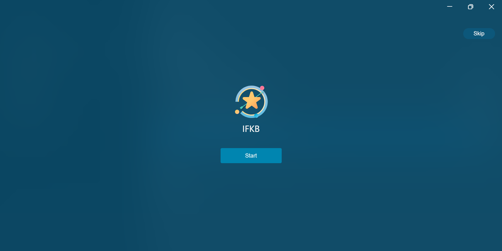

    
    
Fabulous

    
Cross-platform notebook and literature workspace for reading, writing, and organizing research.

    

        
        
    

    

# Fabulous Desktop

Fabulous Desktop is the Electron edition of the Fabulous ecosystem.

It combines:

- local notebook editing with `.fbn`, Markdown, HTML, and JSON support
- document-centered note taking
- PDF reading and literature management workflows
- desktop file association, local folder browsing, and automatic updates

## Documents

- [English Guide](./doc/English.md)
- [中文说明](./doc/Chinese.md)
- [Developer Guide](./doc/README.dev.md)

## Download

Download the latest release from:

- <https://github.com/Creator-SN/Fabulous/releases>

## Highlights

- WYSIWYG notebook editing with Markdown-friendly workflows
- Local-first notebook browsing and file operations
- `.fbn` desktop file association support
- Remote service integration for the broader Fabulous ecosystem
- Windows and macOS desktop builds

## Preview

## Platform

- Windows 10 / 11
- macOS

## Related Projects

- Main repository: `Fabulous`
- Web frontend reference: `Fab3`
- Backend service: `FAB_BE`

## License

GPL 3 License
