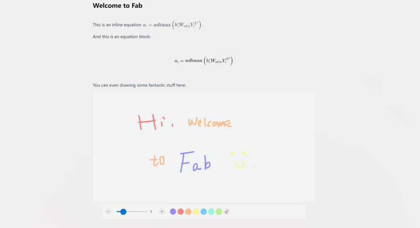
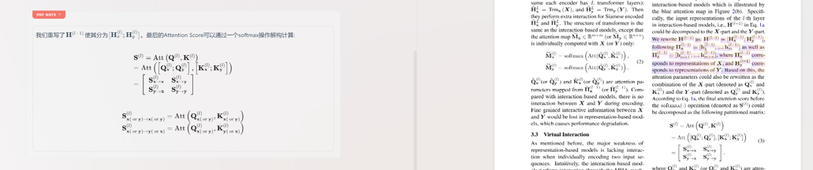

<div align="center">
    
    <p>Fabulous</p>
    <p></p>
    <p>
</div>

<p align="center">
    <a href="LICENSE">
      
    </a>
</p>

# Fabulous Notebook

Fabulous Notebook **(FAB)** is a **WYSIWYG** notebook with an exciting paper and literature management system.

The UI design is based on the [VFluent](https://github.com/aleversn/VFluent), which is inspired by the Microsft [Fluent Design System](https://developer.microsoft.com/en-us/fluentui#/). 

The Application is **Cross Platform** and powered by Electron.

> This project is still working on, we are welcome you to be a contributor. 😄

[中文文档(Chinese)](./doc/Chinese.md)

### 🤔 What can Fab do?

**Fabulous** provides complete **PDF reference management** and powerful **swift notes** experience. We offer:

- PDF document metadata automatic retrieving
- PDF document translation
- Swift Notes with `Markdown` shortcut input supported
- Notes interact with PDF selection

## 🎈 Platform

- ✔ Windows 11 [Supported]
- ✔ Windows 10 [Supported]
- ✔ Mac [Supported]

### 📍 Quick Start

**First Time Installation**

From the releases page, choose the latest stable version and download the installer file.

**First-time Useage**

The first time launching the app, the guide page will be shown up. Just click the next step according to your interests. If you don't want to do reference management, you just need to open the **Notebook System**.


- If you select **Reference Management System**, or **All**, you need to specify a data source.
- The data source is a directory to store **all literature data**. It is **Management-free** after creation, just make sure that the files in it are not modified or deleted. It is also recommended not to create other content inside it.

Enter a nice name and select a suitable directory, and then click **Confirm** to complete the initial setup.


**Reference Management**

Dragging one or multiple PDF references into Fab, then it will automatically retrieve the metadata.


You can see that the title of the document is automatically extracted, and `PDF Reference` and `metadata` are summarized in an `item`. Click `metadata` to view more information.


**Add Reference**

You can also click the `Import` button to import articles on each `partition` page. **Fabulous** will automatically create an `Item` for each article.

**Reference Pages**

You can add multiple notes to each project. Click **Add Page**, and you can quickly create a new beautiful note from the template.


Swift Note supports rich text editing and **Markdown shortcut input**. The format supports of our editor can be displayed as follows:



- Font Style (Bold, Italic, Strike, Underline)
- Block Quote
- Horizontal Rule
- Header
- To-do Task List
- Order List
- Text Align
- Text Color
- Text Highlight
- Drawing Block
- Emoji
- Code
- Inline Equation
- Block Equation
- Image
- Link
- Embed

**Interact with PDF**

Swift Note supports adding `PDF Note` to generate notes associated with the corresponding PDF document location. You only need to select the specified range in the PDF viewer, and then click the yellow button to create the corresponding notes.


In double-column mode, you can see that the notes on the left have created corresponding PDF Notes.



### 🛠 Project setup

```
npm install
```

or

```
yarn
```

#### Compiles and hot-reloads for development

```
npm run electron:serve
```

```
yarn electron:serve
```

#### Compiles and minifies for production
```
npm run build
```

or

```
yarn build
```

#### Lints and fixes files
```
npm run lint
```

or

```
yarn lint
```

### 📚 Doc

#### File Structure

- Config
    * config.json

- Data Structure
    * root/
        * fabulous_files/
            * items[i]
                * *.pdf
                * *.ipcnb
        * data_structure.json

#### Data Structure

**Init Function**

1. load_ds_file

    ```javascript
    load_ds_file(data_path=[])
    => {
        status,
        dbXList: [{
            status,
            db
        }]
    }
    ```
    - status: 
        - `200`: success.
        - `404`: data_path is empty.
        - `500`: source url not found.
        - `502`: data_structure.json not found.
    - dbXList: A array of each source object, each object contains the current ds' db and status.
    - db: A data_structure's lowdb DataStore.

2. init_ds

    ```javascript
    init_ds(id, name, ds_db)
    => default
    ```

### License

GPL 3 License

Copyright (c) 2021 Creator SN®
