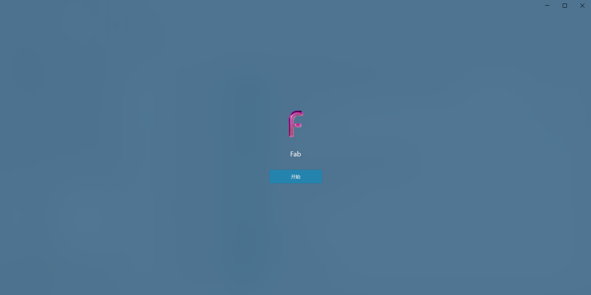
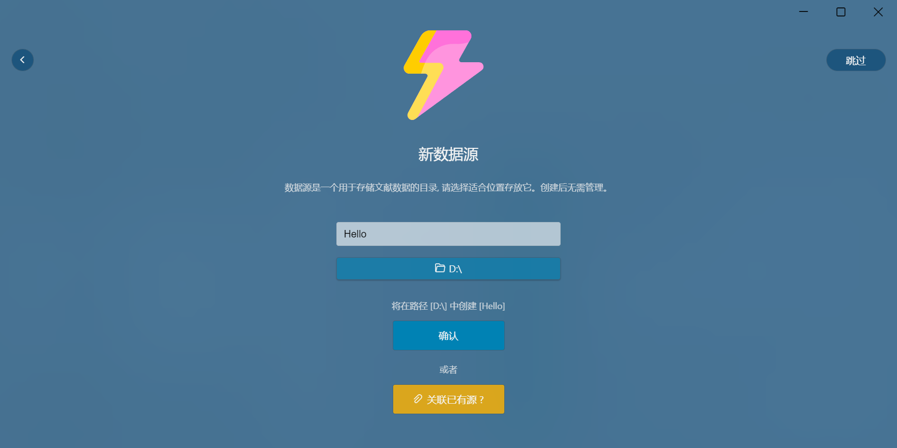
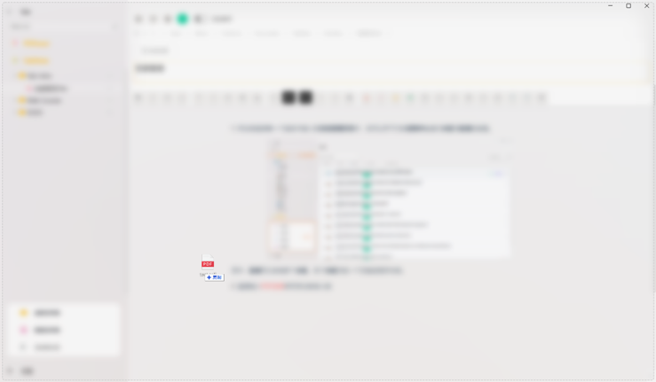
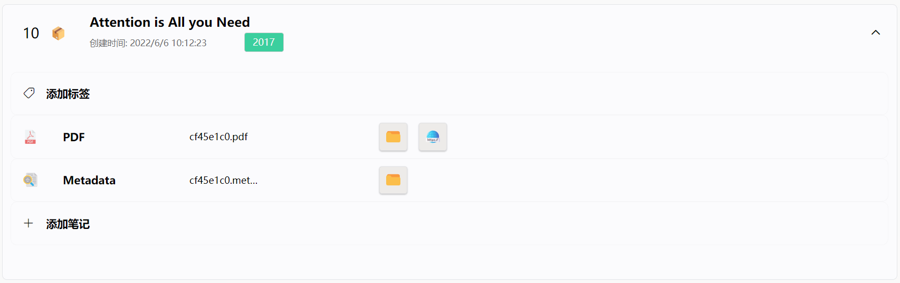
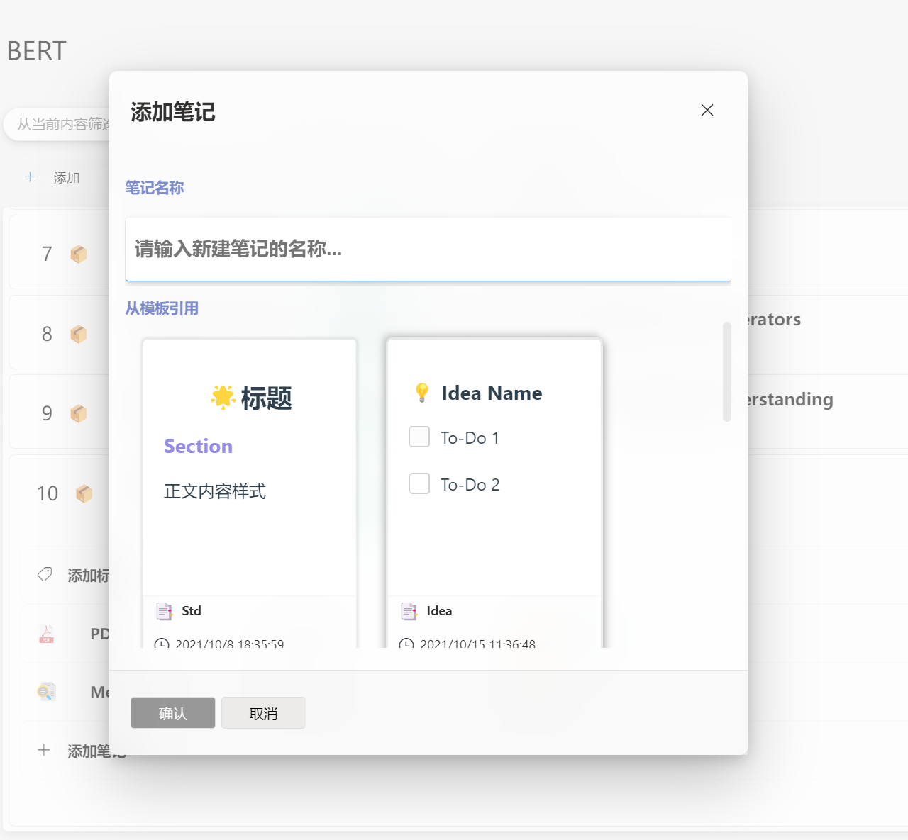
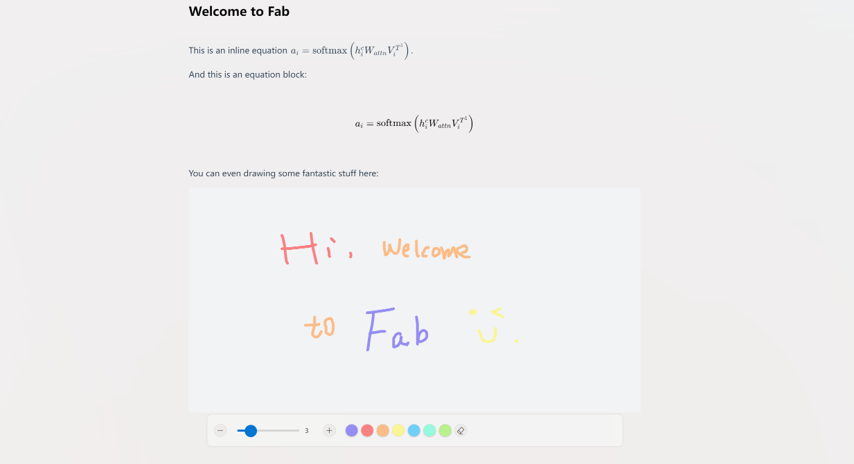
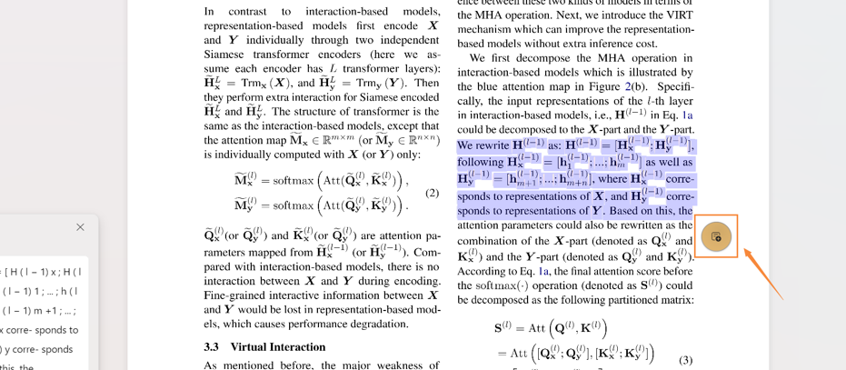
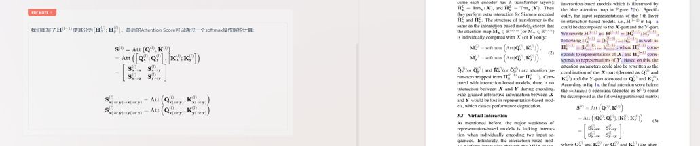

# Fab

**Fab (Fabulous)** - 集文献管理和出色笔记体验的应用

**Fab** 是`Electron`驱动的基于 [Microsft Fluent Design System](https://developer.microsoft.com/en-us/fluentui#/) Win UI 3.0的文献管理 + 笔记管理综合应用。

> 关于UI组件库的更多信息, 请了解[VFluent](https://github.com/aleversn/VFluent)。

> 该项目仍在进行中，我们欢迎您成为贡献者。 😄

## 🤔 Fab可以做什么?

**Fabulous**提供完整的**PDF文献管理**和出色的**妙动笔记**体验。我们提供:

- PDF文献元数据自动检索归纳
- PDF文献阅读划词翻译
- 支持`Markdown`输入的富文本妙动笔记
- 笔记与PDF选区互动

## 🎈 平台

- ✔ Windows 11 [支持]
- ✔ Windows 10 [支持]
- ✔ Mac [支持]

### 📍 快速上手

**首次安装**

从发布(`Release`)页面，选择最新的稳定版本并下载。

**首次使用**

首次使用会弹出引导页, 根据自己的兴趣爱好往下走就够了, 如果你只想做笔记管理, 则只需开启**笔记本系统**。

- 如果你选择了**文献管理系统**, 或**全部开启**, 则需要指定一个数据源。
- 数据源是一个用于**存储文献数据的目录**，创建后**不用管理它**, 确保里面的文件不要被修改删除即可, 也建议不要在里面自行创建其他内容。

输入好名称, 选择好目录后, 点击**确认**即可完成初次引导设置。

**文献管理**

直接拖入一篇或多篇文献PDF文件即可将文献导入到Fab中，Fab会自动解析并检索文献的元数据。

你可以看到文献的标题被自动识别出来了,`PDF文献`和`元数据(Metadata)`被归纳在一个`项目`里 点击`Metadata`可以查看更多的数据。

**添加文献**

您也可以单击`导入`按钮在每个`分区`页面中导入文章，**Fabulous**会自动为每篇文章创建一个`项目`。

**文献笔记**

在每一个项目中都可以添加多个笔记, 点击**添加笔记**, 你可以从模板中快速新建一个格式优美的笔记。

妙动笔记支持丰富的文本编辑和**Markdown快捷编辑方式**。我们编辑器的扩展功能可以显示如下：

- 字体样式（粗体，斜体，笔划，下划线）
- 块引用
- 水平线
- 标题头
- 任务列表 
- 顺序列表
- 文本对齐
- 文本颜色
- 文本突出显示
- 绘图块
- Emoji表情
- 代码块
- 行内公式
- 块公式
- 图片
- 链接
- 嵌入

**与PDF联动**

Fab妙动笔记支持通过添加`PDF Note`来生成与对应PDF文献位置关联的笔记，你只需在PDF浏览器上选择指定内容，然后点击黄色小按钮即可在妙动笔记里创建对应的笔记。

在双栏模式下, 你可以看到左侧的笔记已经创建了对应的PDF块。

