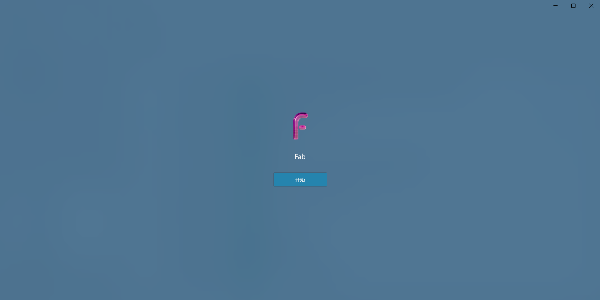
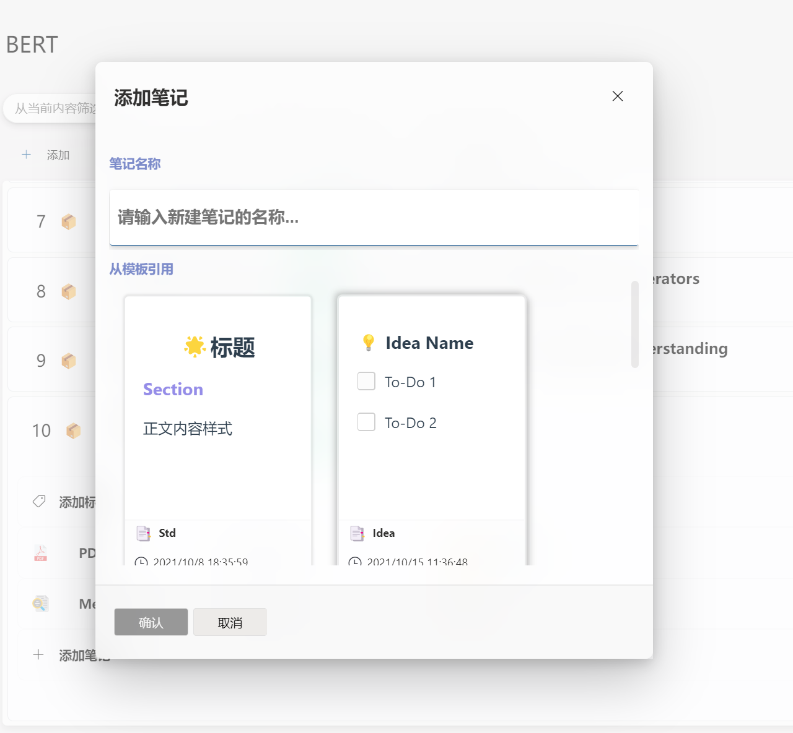
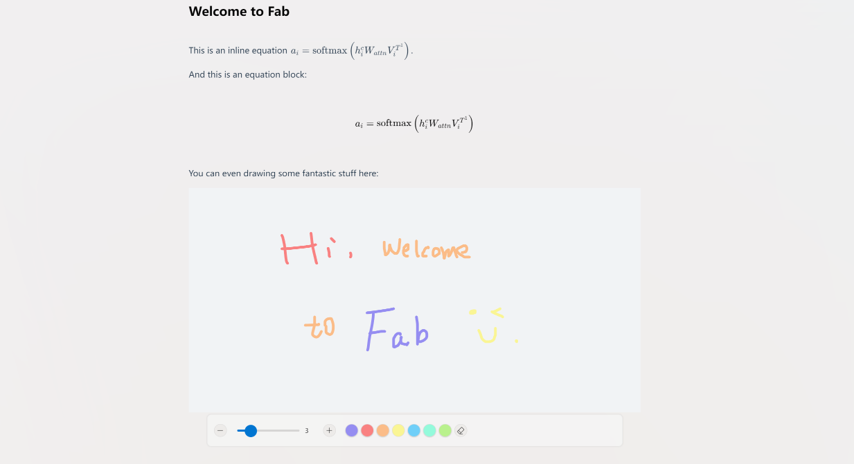

    
    
Fabulous

    
一个面向阅读、写作与研究整理的跨平台桌面工作区。

    
    

# Fabulous Desktop

Fabulous Desktop 是 Fabulous 生态的本地 Electron 桌面版。

它把本地笔记编辑、研究资料整理、文件路径工作流和桌面端交互整合在同一个应用里。

## 文档

- [English Guide](./English.md)
- [开发说明](./README.dev.md)

## Fabulous 能做什么？

Fabulous 提供：

- 支持 `.fbn`、Markdown、HTML、JSON 的本地笔记编辑
- 所见即所得的快速写作体验
- 本地文件夹浏览与文件管理
- 面向 PDF 阅读与文献整理的工作流
- 支持从系统中直接双击打开 `.fbn` 文件

## 支持平台

- Windows 10 / 11
- macOS

## 快速开始

**下载安装**

请从这里下载最新版本：

- <https://github.com/Creator-SN/Fabulous/releases>

**首次启动**

第一次打开应用后，你可以直接从本地笔记区域开始使用。

如果你还需要更完整的文献整理流程，Fabulous 也可以继续承担更完整的桌面研究工作区角色，而不只是一个笔记编辑器。

## 本地笔记工作流

Fabulous Desktop 支持偏本地优先的笔记方式：

- 将某个文件夹作为本地笔记工作区打开
- 直接从系统中打开单个 `.fbn` 文件
- 在当前本地根目录下搜索笔记文件
- 编辑后按原文件路径直接保存

## 阅读与写作体验

编辑器提供较完整的富文本写作能力，同时保留适合 Markdown 使用者的操作习惯。

常见能力包括：

- 标题、列表、任务列表与引用块
- 加粗、斜体、下划线、删除线等行内格式
- 链接、图片、嵌入与代码块
- 本地笔记内容刷新与保存

## 桌面版特性

相比纯 Web 前端，桌面版额外支持：

- 本地文件与文件夹访问
- 自定义标题栏与窗口控制
- 单实例运行
- `.fbn` 文件关联
- 自动更新集成

## License

GPL 3 License
