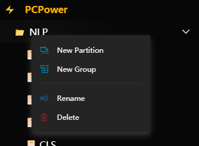
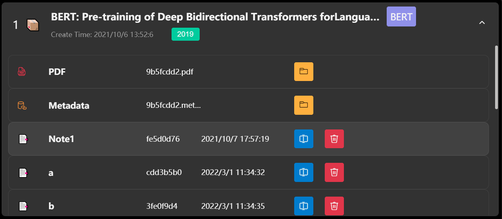

    
    
Fabulous

    
A cross-platform desktop workspace for reading, writing, and organizing research notes.

    
    

# Fabulous Desktop

Fabulous Desktop is the local Electron edition of the Fabulous ecosystem.

It combines local notebook editing, research material organization, file-based workflows, and desktop-native interactions in one place.

## Documents

- [中文说明](./Chinese.md)
- [Developer Guide](./README.dev.md)

## What can Fabulous do?

Fabulous provides:

- local notebook editing with `.fbn`, Markdown, HTML, and JSON support
- quick WYSIWYG note writing
- local folder browsing and file management
- PDF-centered reading and literature workflows
- desktop file association so `.fbn` files can be opened directly from the system

## Platform

- Windows 10 / 11
- macOS

## Quick Start

**Install**

Download the latest release from:

- <https://github.com/Creator-SN/Fabulous/releases>

**First Launch**

After opening the app for the first time, you can start directly from the local notebook area.

If you also need the wider literature-management workflow, Fabulous can continue to serve as a richer desktop workspace beyond note editing alone.

## Local Notebook Workflow

Fabulous Desktop supports a local-first notebook workflow:

- open a folder as a local notebook workspace
- open a single `.fbn` file directly from the system
- search notebook files inside the current local root
- edit and save notebooks back to their original file paths

## Reading and Writing Experience

The editor provides a rich WYSIWYG writing experience while keeping Markdown-friendly behavior where appropriate.

Typical capabilities include:

- headings, lists, checklists, and block quotes
- inline formatting such as bold, italic, underline, and strike
- links, images, embeds, and code blocks
- local notebook content refresh and save

## Desktop Features

Compared with the pure web frontend, the desktop edition additionally supports:

- local file and folder access
- desktop title bar and window controls
- single-instance behavior
- `.fbn` file association
- automatic update integration

## License

GPL 3 License
